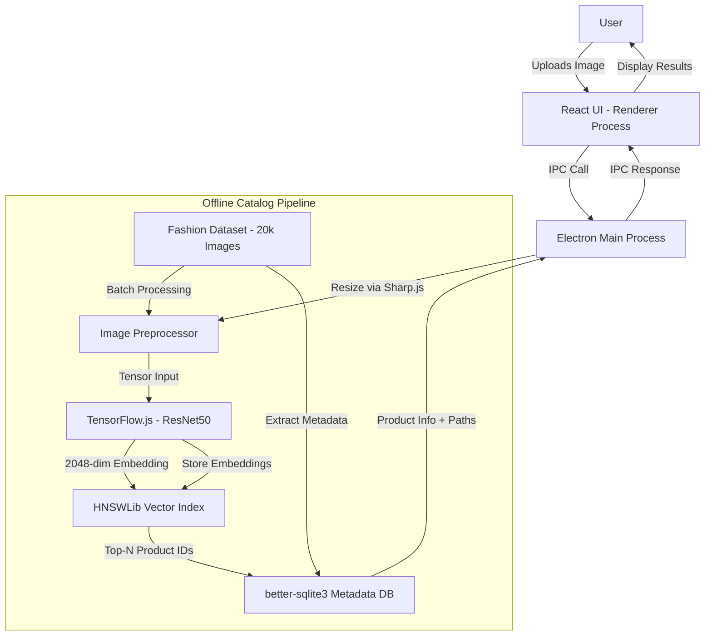
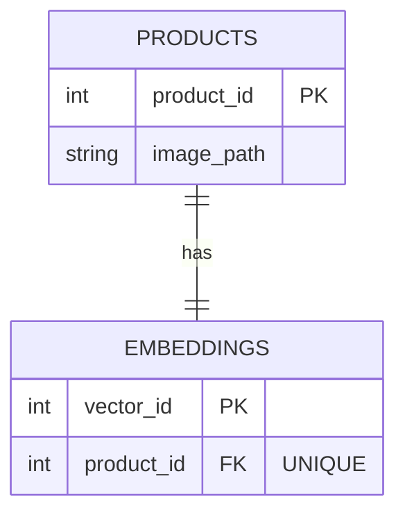
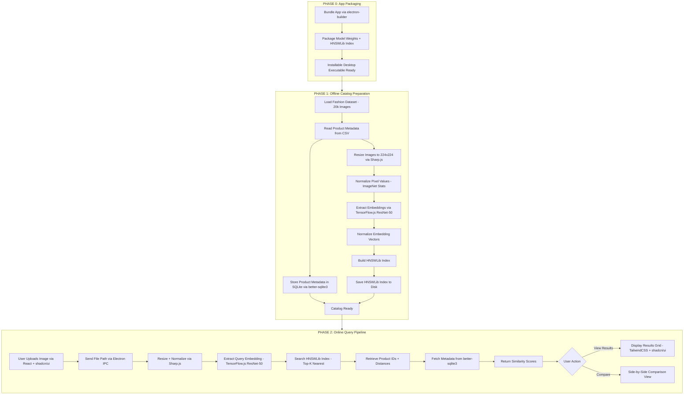

# 🔍 Visual Product Comparison & Similarity Engine

> A fully offline, on-device Visual Product Comparison Engine for fashion e-commerce — powered by deep learning embeddings and real-time vector similarity search across 20,000+ products.

---

##  1. Problem Statement

### Problem Title
**Lack of Offline Visual Product Search in Fashion E-Commerce**

### Problem Description
Online shopping is inherently visual. Users frequently have a screenshot of a product, want alternatives to a design they like, or are looking for visually similar items across different brands and price ranges. However, current product discovery relies heavily on text-based search and metadata matching, which fails to capture the **visual essence** of what a user is actually looking for.

Existing visual search solutions depend entirely on **cloud-based APIs, external ML services, and server-side processing** — making them unsuitable for offline use, raising privacy concerns, and introducing latency and cost dependencies.

### Target Users
- Fashion e-commerce platforms seeking on-device product discovery
- Privacy-conscious users who want visual search without uploading images to the cloud
- Retailers and stylists who need quick visual similarity lookups in-store or offline
- Developers building offline-first shopping experiences

### Existing Gaps
| Gap | Description |
|-----|-------------|
| **Cloud Dependency** | All major visual search tools (Google Lens, Amazon StyleSnap) require internet |
| **Latency** | Network round-trips add 2–5 seconds of delay per query |
| **Cost** | Cloud vision APIs charge per request, making them expensive at scale |
| **No Local Intelligence** | No existing open-source solution offers a complete offline visual search pipeline |

---

##  2. Problem Understanding & Approach

### Root Cause Analysis
The core issue is that **visual similarity is computed on remote servers**, creating a hard dependency on internet connectivity and third-party services. The fashion domain is particularly suited for visual search because users think in terms of visual attributes — color, pattern, shape, style — not keywords.

### Solution Strategy
We take a **feature-space comparison** approach:

1. **Extract deep visual features** from every catalog image using a pretrained CNN — converting each image into a compact numerical embedding vector.
2. **Store all embeddings locally** as a searchable vector index.
3. **At query time**, extract the embedding of the uploaded image and compute **cosine similarity** against the entire catalog in real-time.
4. **Rank and return** the most visually similar products with confidence scores.

This shifts all intelligence to the **user's device**, eliminating cloud dependency entirely.

---

##  3. Proposed Solution

### Solution Overview
An offline desktop application that accepts any fashion product image and instantly retrieves the most visually similar items from a 20,000+ product catalog using deep learning-based visual embeddings and vector similarity search.

### Core Idea
Replace text-based product matching with **visual vector-space search** — where products are compared by their visual DNA (embedding vectors) rather than metadata tags.

### Key Features
- **Image Upload** — Drag-and-drop or file picker for query images
- **Visual Similarity Search** — Real-time retrieval of top-N similar products
- **Similarity Scoring** — Cosine similarity percentage for each match
- **Side-by-Side Comparison** — Compare query image with any result in detail
- **Fully Offline** — Zero internet dependency after initial setup
- **Real-Time Inference** — Sub-second query response with HNSWLib indexing

---

##  4. System Architecture

### High-Level Flow
```
User → React UI (Renderer) → Electron IPC → Main Process (TensorFlow.js + Sharp) → HNSWLib Index → SQLite (better-sqlite3) → Ranked Results → React UI
```

### Architecture Description



**Components:**
| Component | Technology | Role |
|-----------|-----------|------|
| Desktop Runtime | Electron + Vite | Cross-platform desktop app, fully offline |
| Frontend UI | React.js + TailwindCSS + shadcn/ui | Drag-and-drop UI, results display |
| ML Model | TensorFlow.js + ResNet-50 (local weights) | 2048-dim visual embeddings |
| Image Preprocessing | Sharp.js | Resize to 224×224, normalize input |
| Vector Search | HNSWLib (Node binding) | Fast ANN search over 20K embeddings |
| Metadata Storage | SQLite via better-sqlite3 | Product metadata only (NO embeddings) |
| Packaging | electron-builder | Bundle app + model + index file |

---

##  5. Database Design

### ER Diagram



### ER Diagram Description
- **PRODUCTS** — Stores the product ID and image path for each of the 20,000 fashion items
- **EMBEDDINGS** — Maps each product to its corresponding vector in the HNSWLib index via `vector_id` (1:1 relationship)

---

## 6. Dataset Selected

| Field | Details |
|-------|---------|
| **Dataset Name** | Fashion Product Images Dataset |
| **Source** | [Kaggle — Fashion Product Images](https://www.kaggle.com/datasets/paramaggarwal/fashion-product-images-dataset) |
| **Data Type** | RGB product images (`.jpg`) + metadata (`.csv`) |
| **Total Images** | 20,000 labeled fashion product images (subset of 44,000+) |
| **Categories** | Apparel, Footwear, Accessories, Bags, Watches, Sportswear, Ethnic Wear, Casual Wear, Formal Wear, and more |

### Selection Reason
- One of the **largest** open-source fashion datasets available
- **Diverse categories** covering the full spectrum of fashion products
- **Clean, standardized** product images on white backgrounds — ideal for embedding extraction
- Includes rich **metadata** (category, subcategory, color, gender, season)

### Preprocessing Steps
1. **Resize** all images to `224 × 224` pixels using Sharp.js (ResNet50 input size)
2. **Normalize** pixel values using ImageNet mean & std (`[0.485, 0.456, 0.406]`, `[0.229, 0.224, 0.225]`)
3. **Convert** to RGB if grayscale
4. **Batch process** through TensorFlow.js feature extractor to generate embeddings
5. **Store** embeddings in HNSWLib index file and product metadata in SQLite (via better-sqlite3)

---

## 7. Model Selected

### Model Name
**ResNet50** (Residual Network, 50 layers) — pretrained on ImageNet

### Selection Reasoning
| Criteria | ResNet50 |
|----------|----------|
| **Accuracy** | High — trained on 1.2M images, 1000 classes |
| **Embedding Quality** | 2048-dim feature vectors from penultimate layer capture rich visual semantics |
| **Speed** | Fast inference (~30ms per image on CPU) |
| **Size** | ~98 MB — practical for offline bundling with Electron |
| **Ecosystem** | Available as TensorFlow.js GraphModel for in-browser/Node.js inference |
| **Proven** | Industry standard for visual feature extraction and transfer learning |

### Alternatives Considered
| Model | Why Not Selected |
|-------|-----------------|
| **VGG16** | Larger model (528 MB), slower inference, similar accuracy |
| **EfficientNet-B0** | Slightly better accuracy but more complex preprocessing |
| **MobileNetV2** | Lighter (14 MB) but lower embedding quality for fine-grained fashion similarity |
| **CLIP (ViT-B/32)** | Excellent embeddings but heavier (600 MB+) and overkill for single-modal image search |

### Evaluation Metrics
- **Top-K Retrieval Accuracy** — % of correct matches in top-K results
- **Mean Average Precision (mAP)** — Precision across varying K values
- **Cosine Similarity Distribution** — Average similarity score for similar vs dissimilar product retrievals
- **Query Latency** — Time from image upload to results display

---

##  8. Technology Stack

| Layer | Technology | Purpose |
|---|---|---|
| **Desktop Runtime** | Electron + Vite | Cross-platform desktop app, fully offline |
| **Frontend UI** | React + TailwindCSS + shad cn/ui | Drag-and-drop UI, results display |
| **ML Model** | TensorFlow.js + ResNet-50 (local weights) | 2048-dim visual embeddings |
| **Image Preprocessing** | Sharp.js | Resize to 224×224, normalize input |
| **Vector Search** | HNSWLib (Node binding) | Fast ANN search over 20K embeddings |
| **Metadata Storage** | SQLite (better-sqlite3) | Product metadata only (NO embeddings) |
| **Packaging** | electron-builder | Bundle app + model + index file |

---

## 9. IPC API Documentation & Testing

Since this is an Electron desktop app, all communication between the React frontend (renderer process) and the backend logic (main process) happens via **Electron IPC** (Inter-Process Communication) — not HTTP REST APIs.

### IPC Channels List

#### Channel 1: `search:by-image`
**Description:** Send an image file path and retrieve visually similar products

| Field | Value |
|-------|-------|
| Direction | Renderer → Main → Renderer |
| Channel | `search:by-image` |
| Payload | `{ filePath: string, topK: number }` |

**Response:**
```json
{
  "queryImage": "/path/to/uploaded/image.jpg",
  "results": [
    {
      "productId": 15970,
      "similarityScore": 0.94,
      "imagePath": "/dataset/images/15970.jpg"
    }
  ],
  "totalResults": 10,
  "processingTimeMs": 120
}
```

---

#### Channel 2: `product:get-details`
**Description:** Get detailed product metadata by ID

| Field | Value |
|-------|-------|
| Direction | Renderer → Main → Renderer |
| Channel | `product:get-details` |
| Payload | `{ productId: number }` |

**Response:**
```json
{
  "productId": 15970,
  "imagePath": "/dataset/images/15970.jpg"
}
```

---

#### Channel 3: `product:compare`
**Description:** Side-by-side comparison of two products

| Field | Value |
|-------|-------|
| Direction | Renderer → Main → Renderer |
| Channel | `product:compare` |
| Payload | `{ productId1: number, productId2: number }` |

**Response:**
```json
{
  "product1": { "productId": 15970, "imagePath": "/dataset/images/15970.jpg" },
  "product2": { "productId": 23456, "imagePath": "/dataset/images/23456.jpg" },
  "similarityScore": 0.87
}
```


### IPC Testing Screenshots
> *Electron DevTools / manual testing screenshots will be added after implementation.*

---

##  10. Module-wise Development & Deliverables

### Checkpoint 1: Research & Planning
**Deliverables:**
- [x] Problem statement finalization
- [x] Dataset selection and analysis
- [x] Model selection and benchmarking
- [x] System architecture design
- [x] README documentation

---

### Checkpoint 2: Electron + Backend Development
**Deliverables:**
- [ ] Electron + Vite project scaffold
- [ ] Electron main process with IPC handlers
- [ ] Image upload and preprocessing pipeline (Sharp.js)
- [ ] IPC channels (`search:by-image`, `product:get-details`, `product:compare`)
- [ ] SQLite database setup with better-sqlite3
- [ ] Error handling and input validation

---

### Checkpoint 3: Frontend Development
**Deliverables:**
- [ ] React + TailwindCSS + shadcn/ui setup
- [ ] Image upload component (drag-and-drop + file picker)
- [ ] Search results grid with similarity scores
- [ ] Side-by-side comparison view
- [ ] Loading states and animations

---

### Checkpoint 4: Model Loading + Embedding Generation
**Deliverables:**
- [ ] TensorFlow.js ResNet50 model bundling (locally stored weights)
- [ ] Batch embedding extraction for all 20k images
- [ ] Embedding storage in HNSWLib index format
- [ ] Embedding normalization and validation
- [ ] Benchmarking: speed and quality metrics

---

### Checkpoint 5: ML Integration
**Deliverables:**
- [ ] Connect HNSWLib index to search IPC handler
- [ ] Real-time query embedding extraction via TensorFlow.js
- [ ] Cosine similarity computation and ranking
- [ ] End-to-end pipeline testing

---

### Checkpoint 6: Packaging & Deployment
**Deliverables:**
- [ ] electron-builder configuration for cross-platform packaging
- [ ] Bundle model weights + HNSWLib index into distributable
- [ ] Documentation for installation and usage
- [ ] Demo video recording
- [ ] Final README polish

---

## 11. End-to-End Workflow



---

##  12. Demo & Video

| Resource | Link |
|----------|------|
| **PPT LINK** | [View PPT Here](https://drive.google.com/drive/folders/1D2Ryyw6002_d1hoYzOMboLPbLsb2h854?usp=sharing) |
| **Demo Video** | [Demo Video Here](https://drive.google.com/file/d/11iu54CsdgsbmHaOYYAvDqbXQYpJfvCO7/view?usp=sharing) |
| **GitHub Repository** | [Visual-Product-Comparison-Engine](https://github.com/Yashsingh045/Visual-Product-Comparison-Engine) |

---

##  13. Hackathon Deliverables Summary

| # | Deliverable | 
|---|------------|
| 1 | Problem Statement & Documentation |  
| 2 | System Architecture & Design |  
| 3 | Dataset Preprocessing Pipeline (Sharp.js) |  
| 4 | Embedding Generation via TensorFlow.js (20k images) |  
| 5 | Electron Main Process + IPC Handlers |  
| 6 | React + shadcn/ui Frontend |  
| 7 | HNSWLib Integration & Similarity Search |  
| 8 | Side-by-Side Comparison Feature |  
| 9 | End-to-End Testing |  
| 10 | Demo Video & Final Documentation |  

---

## 👥 14. Team Roles & Responsibilities

| Member Name | Role |
|-------------|------|    
| **Yashveer Singh** | Backend Engineer
| **Vipul** | Frontend and UX Engineer
| **Abhay Pratap Yadav** | ML Engineer

---

##  15. Future Scope & Scalability

### Short-Term
-  **Text + Visual Hybrid Search** — Combine text queries ("red sneakers") with visual similarity
-  **Mobile App** — React Native port for on-device mobile search
-  **Color-Based Filtering** — Dominant color extraction for refined filtering
-  **User Analytics** — Track popular searches and trending styles

### Long-Term
-  **Multi-Modal Search (CLIP)** — Search using text descriptions to find visually matching products
-  **E-Commerce Integration** — Plugin for Shopify, WooCommerce, and other platforms
-  **Distributed Catalog** — Scale to millions of products using distributed vector indexes
-  **Style Recommendations** — AI-powered outfit suggestions based on visual preferences
-  **Real-Time Camera Search** — Point phone camera at a product to find similar items instantly

---

##  16. Known Limitations

| Limitation | Description |
|-----------|-------------|
| **First-Run Processing Time** | Initial embedding generation for 20k images takes 15–30 minutes on CPU  |
| **No Text Search** | System is purely visual — no keyword/text-based product search |
| **Fashion Domain Only** | Trained and optimized for fashion products; may not generalize to other domains |
| **CPU Inference** | Without GPU, real-time performance depends on HNSWLib indexing efficiency |
| **Static Catalog** | New products require re-running the embedding pipeline |
| **Image Quality Sensitivity** | Low-resolution or heavily cropped query images may yield lower accuracy |

---

## 17. Impact

| Impact Area | Description |
|-------------|-------------|
| **Privacy** | Zero data leaves the user's device — fully privacy-preserving visual search |
| **Accessibility** | Works in areas with poor or no internet connectivity |
| **Cost Reduction** | Eliminates per-query cloud API costs for visual search |
| **User Experience** | Sub-second visual results vs 2–5s cloud latency |
| **Industry Relevance** | Applicable to retail, fashion, interior design, and visual inventory management |

---